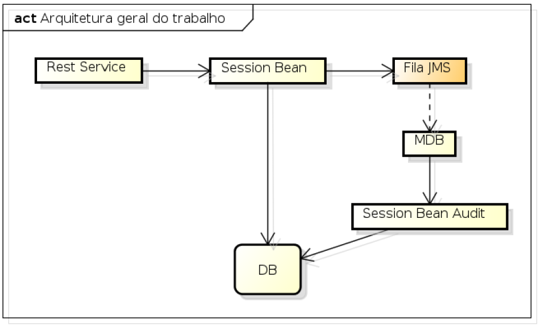

<h1 align="center">Projeto JavaEE - DM110</h1>

### :books: Descrição

<p>Projeto da disciplina DM110 - Desenvolvimento JavaEE </p>
<p>Trata-se de um projeto simples que utiliza-se dos conhecimentos relacionados a JavaEE adquiridos na disciplina, a ideia principal é criar de forma concisa um serviço para realização de um CRUD completo de produtos, esse serviço conta com auditoria integral de todos as operações e chamadas realizadas ao decorrer da utilização.</p>

### :computer: Projeto
<p>A estrutura básica de funcionamento de projeto pode ser vista na imagem abaixo: </p> 

<p align="center">


#### :hammer_and_wrench: Recursos utilizados na construção
- [Eclipse IDE for Enterprise Java and Web Developers](https://www.eclipse.org/downloads/packages/)
- [JDK 17](https://www.oracle.com/java/technologies/downloads/#java17)
- [Wildfly](https://www.wildfly.org/)
- [Maven](https://maven.apache.org/index.html)
- [Lombok](https://projectlombok.org)
- [HyperSQL](http://hsqldb.org)

#### :building_construction: Instalação

#### :arrow_forward: Execução


### :computer: Funcionalidades do Projeto
<p>Como descrito anteriormente a ideia principal é realizar operações de um produto, as informações trabalhadas a cerca deste serão: </p>

```
code - Código de registro do produto
name - Nome do produto.
description - Breve descrição acerca do produto.
price - Valor do produto
category - Categoria do produto (ex. Limpeza, Alimentação...)
```

Dessa forma acessando os endpoints você poderá manipular e trabalhar com as operações mais básicas relacionadas a estes produtos.

| Endpoint |Metodo| Descrição |
|---|---|---|
| `/product` | POST |Utilizado para realizar a criação do(s) produto(s)|
| `/product` | GET |Utilizado para realizar a recuperação de todos produtos|
| `/product/{code}` | GET|Utilizado para realizar a recuperação de um produto especifico|
| `/product/{code}`|PUT |Utilizado para realizar a atualização de um produto especifico|
| `/product/{code}`| DELETE |Utilizado para realizar a remoção de um produto especifico|

Todas as operações realizadas são auditadas, dessa forma aumentando o nível de controle  e maturidade da plataforma. O exemplo a seguir mostra o valor que você terá acesso:

```

[identifier][timestamp][register_code][operation][more information...]
```

Dessa forma de forma fácil você terá acesso a informações como :

```
identifier : Permite identificar qual o log em questão.
register_code : Código do produto cujo o qual está sendo realizada alguma operação.
operation: Operação que foi realizada('Create','Update','Read','Delete')
timestamp: Data e tempo onde aconteceu a operação.
```

## :gear: Autores

* **Flávio Henrique Madureira Bergamini** - [Flávio](https://github.com/flaviobergamini)
* **Gabriel Ilian Fonseca Barboza** - [Gabriel](https://github.com/G-ilian) 